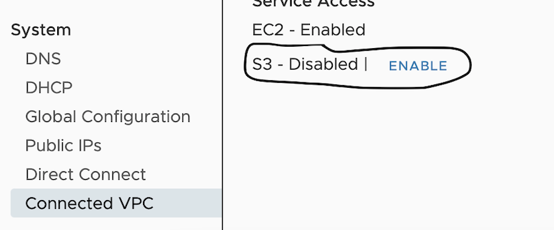

# How we added/built stand-alone tests for Sysdig

- git clone 
- `mkdir/falco`
- `cd falco/`
- `go mod init github.com/aws/aws-k8s-tester/k8s-tester/Sysdig`
- Create a file to implement the Tester Interface.   `touch tester.go`
- copy a vend file from another package    `cp ../vend.sh .`
- Write tests
- run  `./vend.sh`
- run  `go mod tidy -v`


# Test/Run singe test stand-alone
```bash
go run cmd/k8s-tester-sysdig/main.go apply \
    --kubectl-path="/usr/local/bin/kubectl" \
    --kubeconfig-path="/Path/to/kubeconfig" \
    --access-key="1234567890" \
    --collector-endpoint="us2.app.sysdig.com" \
    --log-outputs="sysdig.log"

## Delete
go run cmd/k8s-tester-sysdig/main.go delete \
    --kubectl-path="/usr/local/bin/kubectl" \
    --kubeconfig-path="/Path/to/kubeconfig" \
    --access-key="1234567890" \
    --collector-endpoint="us2.app.sysdig.com" \
    --log-outputs="sysdig.log"
```

# For EKS-A Clusters 

Since Sysdig images use an S3 backed Quay repository, you must make sure to disable Internal S3 endpoints for Vsphere clusters launched in AWS VPC's.

